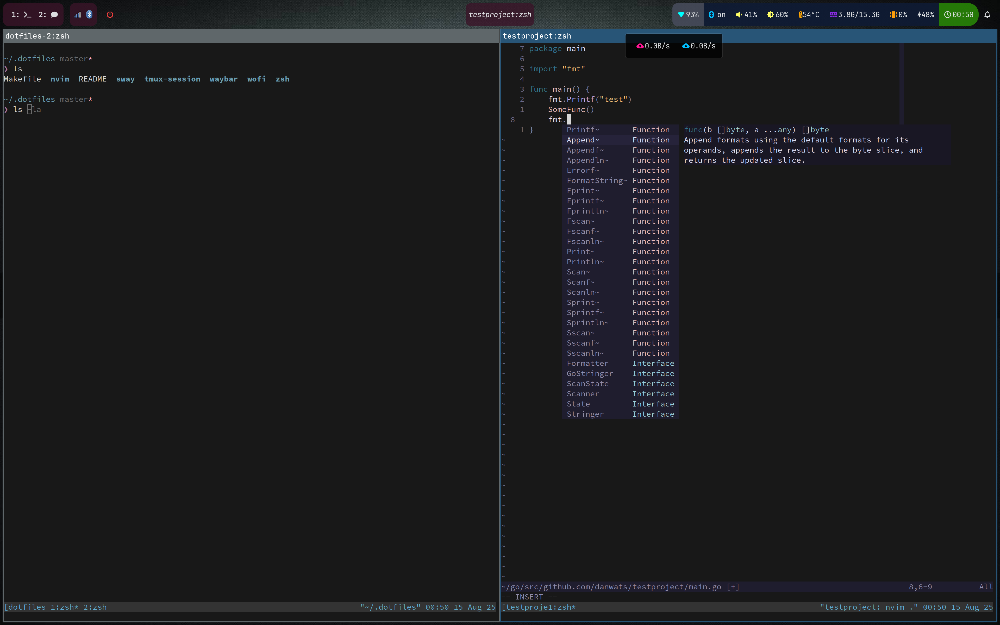

# DotFiles

Use at your own risk. Uses 'stow' package



## Install

Check before install to make sure no conflicts with the following command

```
make check
```

and then if all is looking good run:

```
make install
```

## Packages to install

### ZSH

will need to install zsh-autosuggestions and pure theme

### WAYBAR

install JetBrains MonoNerdFont

